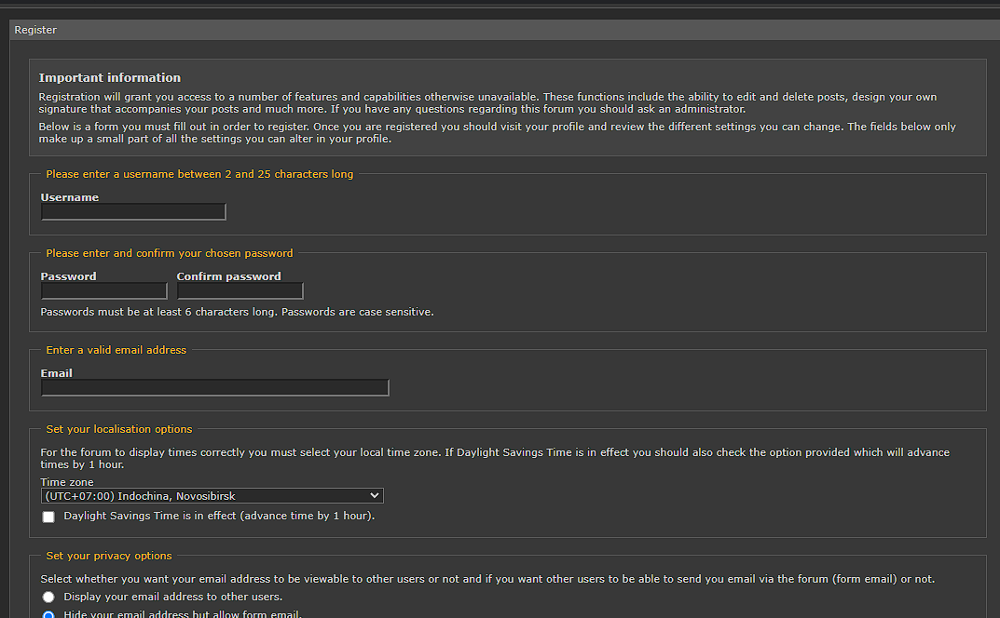
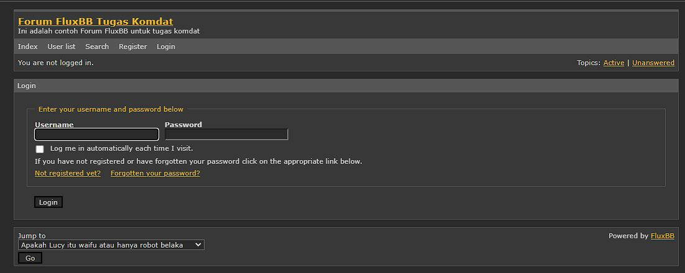
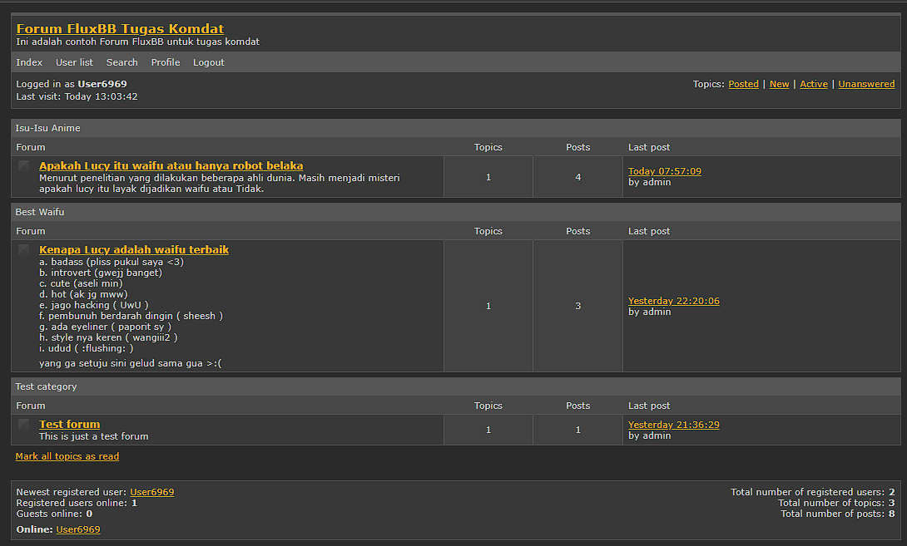
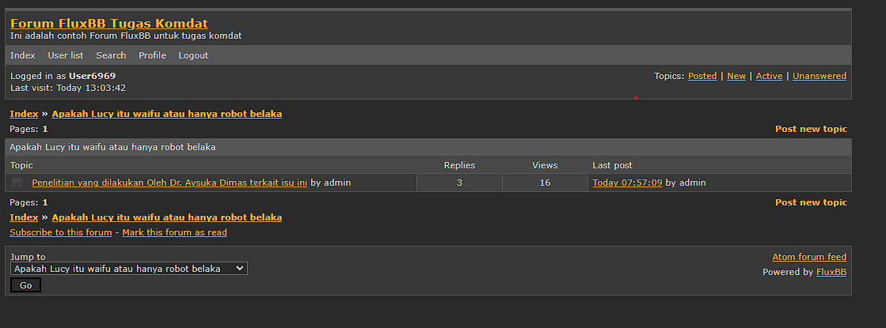
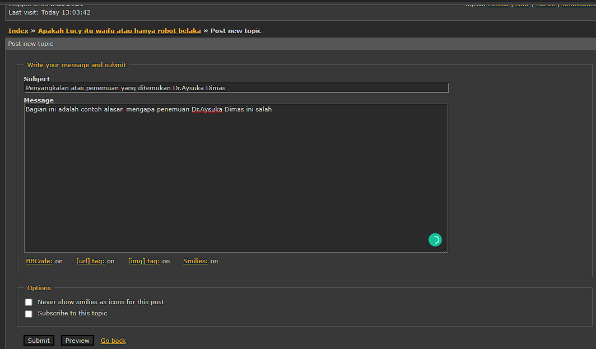
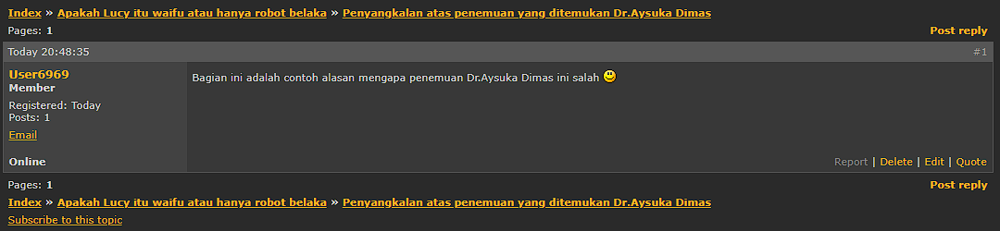
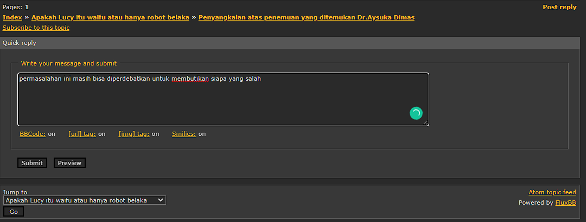
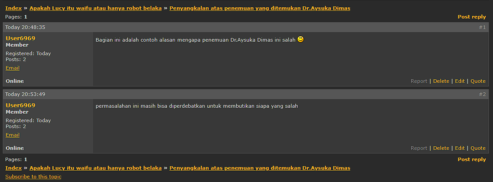

# Proyek Komdat FluxBB

# 

| [Sekilas Tentang](#sekilas-tentang) | [Instalasi](#instalasi) | [Konfigurasi](#konfigurasi) | [Cara Pemakaian](#cara-pemakaian) | [Pembahasan](#pembahasan) | [Referensi](#referensi) |
| :---------------------------------: | :---------------------: | :-------------------------: | :-------------------------------: | :-----------------------: | :---------------------: |

| NIM         | Nama                   |
| ----------- | ---------------------- |
| G6401201023 | Albarra Zikrillah      |
| G6401201099 | Ridho Kartoni Pasaribu |
| G6401201087 | Aysuka Ansari          |

## Sekilas Tentang

**FluxBB** adalah aplikasi forum _open-source_ yang dirilis dibawah GNU General Public Licence dan dapat diunduh dengan gratis. **FluxBB** dirancang sebagai alternatif yang lebih ringan dan cepat untuk beberapa aplikasi forum tradisional yang berat dengan mengurangi fitur-fitur yang "tidak terlalu penting" namun tetap memiliki fitur-fitur yang esensial untuk sebuah aplikasi forum. **FluxBB** mudah digunakan dan sudah memiliki _track record_ yang baik untuk kestabilan dan keamanan sehingga bisa menjadi pilihan aplikasi forum yang ideal untuk website Anda.

## Instalasi

#### Kebutuhan Sistem :

- Sebuah _webserver_
- PHP versi terbaru
- Sebuah DBMS, yaitu MySQL (bisa juga menggunakan DBMS yang lain)

#### Proses Instalasi :

1. Sediakan sebuah Virtual Machine yang akan digunakan sebagai _server_. Disini kami menggunakan sebuah VM Engine Instance dari Google Cloud.
   
2. Lakukan login ke _server_ menggunakan SSH.
   
3. Lakukan _update_ terhadap semua aplikasi dan sistem pada server.

```
sudo apt update
sudo apt upgrade
```

4. _Install_ kebutuhan sistem, sebagai contoh di sini kami menggunakan **Apache** sebagai _webserver_ dan **MySQL** sebagai DBMS.

```
sudo apt install apache2 php mysql-server
sudo apt install php-mysql php-gd php-mbstring php-xml php-curl
sudo service apache2 restart
```

5. Setelah kebutuhan sistem sudah ter-_install_, sebuah _database_ dan _user_ dibuat untuk aplikasi.

```
sudo mysql -u root -ve "
  CREATE DATABASE fluxbb;
  CREATE USER fluxadmin IDENTIFIED BY 'inipaswort';
  GRANT ALL PRIVILEGES ON fluxbb.* TO fluxadmin;
```

6. Unduh berkas instalasi **FluxBB** ke Virtual Machine. Versi **FluxBB** yang akan digunakan adalah versi _stable_ yaitu versi `1.5.11`.

```
sudo wget "https://fluxbb.org/download/releases/1.5.11/fluxbb-1.5.11.tar.gz"
```

7. Ekstrak berkas yang telah diunduh.

```
tar -xvzf fluxbb-1.5.11.tar.gz -C .
```

8. Pindahkan berkas yang sudah diekstrak ke direktori _webroot_

```
sudo mv fluxbb-1.5.11 /var/www/html/fluxbb
```

9. Ubah otorisasi kepemilikan ke _user_ `www-data` (_webserver_)

```
sudo chown -R www-data:www-data /var/www/html/fluxbb
```

10. Buka laman [FluxBB](http://34.128.79.83 "FluxBB") untuk melanjutkan proses instalasi **FluxBB**.
    
11. Jika tidak ada masalah maka akan muncul pemberitahuan seperti di bawah ini yang menandakan bahwa **FluxBB** telah berhasil di-_install_.
    
12. Sekarang halaman _index_ dari forum **FluxBB** sudah bisa diakses.
    
13. Terakhir file instalasi dihapus untuk alasan keamanan.

```
sudo rm -rf /var/www/html/fluxbb/install.php
```

## Konfigurasi

Untuk meningkatkan kinerja aplikasi, kita dapat melakukan hal-hal berikut seperti yang tercantum di [laman pengembangan **FluxBB**](https://github.com/fluxbb/fluxbb#recommendations).

- Gunakan PHP _accelerator_ seperti **APC** atau **XCache** untuk mempercepat waktu eksekusi kode `PHP`.
- Pastikan PHP sudah ter-_install_ modul **zlib** agar **FluxBB** dapat membuat output `gzip`.

Ada beberapa modifikasi yang dapat ditambahkan untuk **FluxBB**, yaitu [**Styles**](#styles), [**Language Packs**](#language-packs), dan [**Plugins**](#plugins).

### Styles

**Styles** berfungsi untuk mengubah tampilan atau tema pada aplikasi forum kita, _package-package_ untuk modifikasi **Styles** ini dapat diunduh dari [laman _repository_ **FluxBB**](http://fluxbb.org/resources/styles/).

Untuk meng-_install_ **Styles** cukup unduh _file_ `css` yang diinginkan lalu pindahkan ke folder `/var/www/html/fluxbb/style `.

### Language Packs

**Language Packs** berfungsi untuk menambah opsi bahasa yang bisa digunakan pada aplikasi forum kita, **Language Packs** dapat diunduh dari [laman _repository_ **FluxBB**](http://fluxbb.org/resources/translations/).

### Plugins

**Plugins** di **FluxBB** hanya bisa menambahkan fitur untuk _administrator_ (dan _moderator_ untuk beberapa **Plugins**) saja, **Plugins** berguna untuk menyederhanakan _task administrator_ atau menambah fitur yang tidak bisa disediakan oleh **FluxBB** (karena filosofinya). **Plugins** dapat diunduh dari [laman _repository_ **FluxBB**](https://github.com/fluxbb/plugins) atau bisa juga kita buat sendiri, _template_-nya dapat diakses di [laman _website_ **FluxBB**](https://fluxbb.org/docs/v1.5/plugins). **Plugins** yang dapat digunakan oleh _administrator_ diawali dengan `AP`, sedangkan yang dapat digunakan oleh _administrator_ dan _moderator_ diawali dengan `AMP`.

## Cara Pemakaian

1. Setelah _User_ mengklik alamat web kami maka user akan disuguhkan dengan halaman depan web kami. _User_ pada langkah ini dapat memilih menjadi pembaca atau _Guest_ atau dengan membuat akun untuk menjadi seorang _User_.
   

2. User* yang tidak \_login* hanya bisa membaca forum dan tidak dapat membuat postingan baru maupun komentar di suatu postingan. Oleh karena itu kita bisa melakukan _Login_ dengan menggunakan akun yang telah kita buat sebelumnya.
   

3. Setelah kita login, kita bisa mulai membuat _Topic_ baru dengan cara memilih forum yang kita inginkan dan memilih _Post New Topic_.
   

4. Dengan mengambil contoh kita memilih salah satu _Forum_ yang ada.
   

5. Setelah kita memilih _Forum_ yang kita mau maka kita bisa memasukkan _Topik_ dan _message_ yang kita ingin sampaikan mengenai _Forum_ tersebut.
   

6. Jika tidak ada masalah, _thread_ kita akan muncul di forum.
   

7. Untuk membalas suatu _Post_ yang dibuat oleh orang lain, kita bisa melakukan reply dengan mengklik _Post Reply_ lalu kita bisa memasukkan _Message_ yang ingin kita sampaikan ke _User_ tersebut.
   

8. Jika tidak ada masalah, _reply_ kita akan muncul di _thread_ yang kita _reply_.
   

## Pembahasan

**FluxBB** merupakan aplikasi diskusi forum yang ditulis dalam bahasa pemrograman `PHP` yang efisien, dinamis, serta didukung oleh banyak _database_ dan _web server_.
Aplikasi forum ini memiliki kelebihan antara lain:

- Memiliki tahap instalasi dan penyetelan _Settings_ yang mudah
- Ringan dan cepat namun tetap memiliki fitur-fitur yang esensial untuk sebuah aplikasi forum.
- Bersifat Gratis dan _open-source_, termasuk perubahan - perubahan yang bisa dilakukan.
- User Interface yang _clean_ dan mudah untuk dipahami khalayak umum.
- _Permission system_ yang fleksibel dan tetap menjamin keamanan.
- _Moderator tools_ yang lengkap dan _powerful_.
- Memiliki komunitas yang antusias untuk melakukan modifikasi terhadap _UI_, maupun dalam pengembangan aplikasi tersebut.

Dibalik kelebihan yang dimiliki, aplikasi ini juga punya kekurangan, antara lain:

- Fitur-fitur yang tersedia hanya yang "standar" saja berdasarkan masa sekarang.
- Tampilan /_UI_ yang terkesan _plain_ dan kurang menarik bagi orang pada umumnya.
- Modifikasi **Plugins** yang bisa dibuat hanya sebatas untuk _administrator_ dan _moderator_ saja.
- Tidak adanya fitur _private message_, akan tetapi tersedianya _e-mail form_.
- Memiliki settingan _Default_ untuk tidak mendukung fitur _attachment_ dan _third party login_, tetapi ada **Plugins** yang dapat di-_install_ untuk menambah fitur tersebut.

Contoh aplikasi forum lainnya adalah **Discourse**, aplikasi ini ditulis dalam bahasa `Ruby` dan `JavaScript`. Jika dibandingkan dengan **FluxBB**, masing-masing memiliki kelebihan dan kekurangan antara lain:

- **Discourse** secara default memiliki fitur yang lebih banyak dibanding **FluxBB**.
- _Plugin-plugin_ yang tersedia di **Discourse** lebih banyak dibanding **FluxBB**.
- Tampilan antarmuka **Discourse** lebih menarik dibanding **FluxBB**.
- **Discourse** tidak sepenuhnya gratis, untuk sebagian fitur seperti _storage space_, jumlah staf (_administrator_, _moderator_), dan _plugin_ yang dapat digunakan secara gratis terbatas jumlahnya. Sedangkan **FluxBB** sepenuhnya gratis.
- **FluxBB** lebih ringan dan cepat dari **Discourse**.
- Instalasi **FluxBB** lebih mudah karena berbasis bahasa `PHP`, instalasi **Discourse** lebih rumit dan memerlukan lebih banyak _requirements_ karena berbasis `Ruby` dan `JS`.

## Referensi

1. [Panduan Pembuatan VM dan _Setting Port-forwarding_](https://github.com/auriza/komdat-lab/blob/master/p01.md) - GitHub Pak Auriza
2. [FluxBB Development Repository](https://github.com/fluxbb/fluxbb) - FluxBB GitHub
3. [FluxBB Homepage](https://fluxbb.org/) - FluxBB
4. [Discourse Homepage](https://www.discourse.org/) - Discourse
